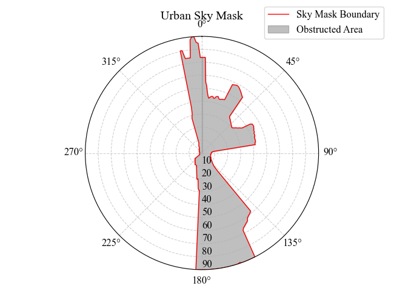
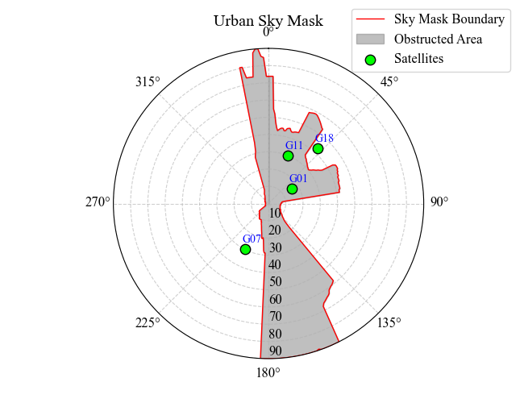
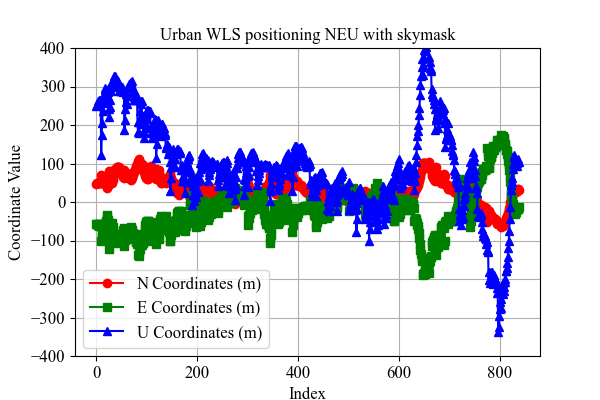
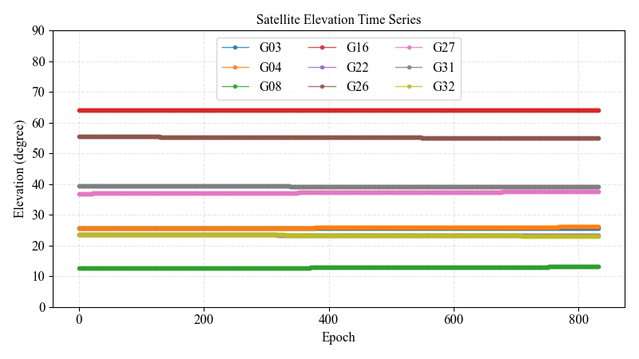
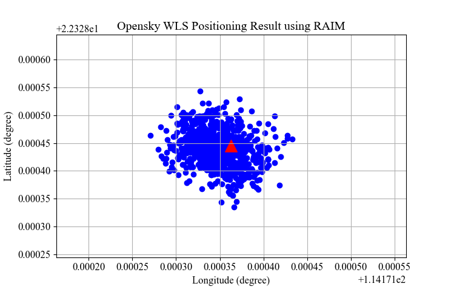
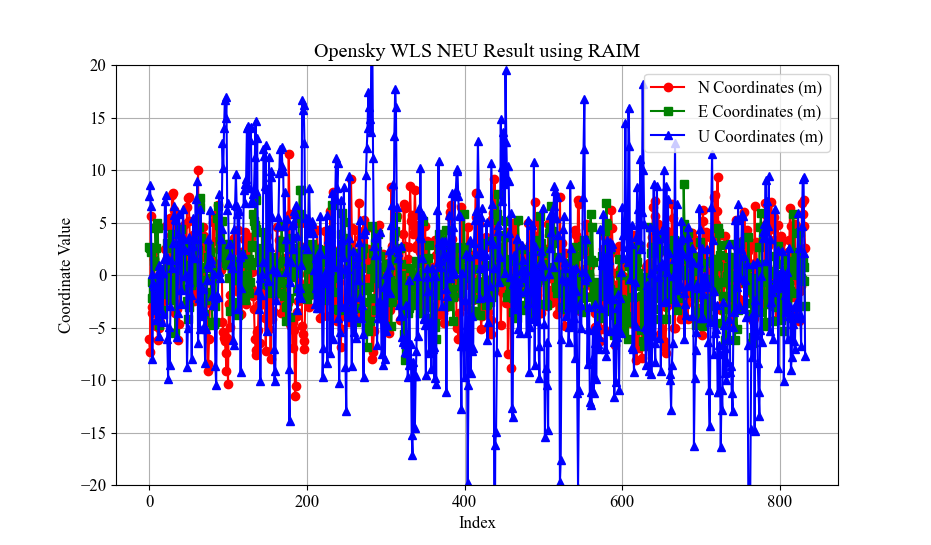
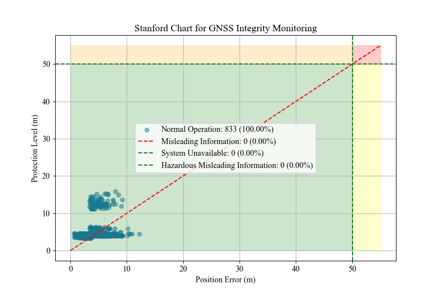

# 1. Comparison of GNSS Positioning Techniques: DGNSS, RTK, PPP, and PPP-RTK

> **Model:** Deepseek
>
> **Prompt:** I am a student working on a research proposal focused on the application of GNSS technology in smartphones. I need to write a section comparing four techniques: Differential GNSS (DGNSS), Real-Time Kinematic (RTK), Precise Point Positioning (PPP), and PPP-RTK. I would like to explore the advantages and disadvantages of each technique. Based on the three reference papers uploaded and your existing knowledge, could you help me by providing a detailed comparison of DGNSS, RTK, PPP, and PPP-RTK, highlighting their strengths and weaknesses? Additionally, please include insights on how these techniques could be integrated into smartphone technology and their potential impact on various applications. About 1000 words in English.
>
> **Comment:** It’s free and great for answering questions.
>
> **Chatroom Link:** [https://chat.deepseek.com/a/chat/s/c3707748-706e-490f-869a-d5051fb77238](https://chat.deepseek.com/a/chat/s/c3707748-706e-490f-869a-d5051fb77238)

The integration of Global Navigation Satellite System (GNSS) technology into smartphones has revolutionized location-based services, enabling applications ranging from pedestrian navigation to precision agriculture. This document compares four key GNSS positioning techniques: Differential GNSS (DGNSS), Real-Time Kinematic (RTK), Precise Point Positioning (PPP), and PPP-RTK, highlighting their strengths, limitations, and applicability to smartphone technology.

## 1.1. DGNSS

**Principle:**  
DGNSS improves positioning accuracy by applying corrections from a reference station to a mobile receiver. These corrections mitigate common errors (e.g., ionospheric delays, satellite clock errors) in pseudorange measurements.

**Accuracy:**  
Typically 1–5 meters, depending on baseline length and signal frequency (e.g., L1 vs. L5).

**Advantages:**
- **Simplicity:** Uses code-based measurements, requiring minimal computational power.
- **Cost-effective:** No need for carrier-phase tracking or high-end hardware.
- **Real-time operation:** Corrections can be transmitted via radio or internet (e.g., NTRIP).

**Disadvantages:**
- **Limited accuracy:** Code noise and multipath limit precision.
- **Dependency on reference stations:** Accuracy degrades with distance from the station.
- **Susceptibility to environmental factors:** Urban canyons and foliage exacerbate multipath errors.

**Smartphone Integration:**  
Modern smartphones with dual-frequency chips (e.g., Xiaomi Mi 8, Huawei P30 Pro) benefit from L5/E5a signals, which exhibit lower noise and multipath compared to L1. DGNSS with L5 pseudoranges reduces horizontal errors by 60-80% compared to L1. However, embedded antennas’ linear polarization and low gain remain challenges.

## 1.2. RTK

**Principle:**  
RTK uses carrier-phase measurements from a base station to resolve integer ambiguities, achieving centimeter-level accuracy.

**Accuracy:**  
1–5 cm in ideal conditions (short baselines).

**Advantages:**
- **High precision:** Suitable for surveying, agriculture, and construction.
- **Rapid convergence:** Ambiguity resolution enables real-time results.

**Disadvantages:**
- **Short baseline requirement:** Errors increase with distance (>10 km).
- **Data dependency:** Requires continuous communication with the base station.
- **Complexity:** Integer ambiguity resolution is sensitive to cycle slips and multipath.

**Smartphone Integration:**  
Recent smartphones (e.g., Google Pixel 5, Samsung S20 Ultra) support raw carrier-phase measurements via Android APIs. However, challenges persist:
- **Antenna limitations:** Poor multipath suppression and phase center variability degrade performance.
- **Duty cycling:** Power-saving modes disrupt phase continuity.
- **Ambiguity resolution:** Unaligned initial phase biases (IPBs) in smartphone chipsets hinder integer fixes unless external antennas are used.

## 1.3. PPP

**Principle:**  
PPP uses precise satellite orbit and clock products (e.g., from IGS) to correct measurements from a single receiver, enabling global decimeter-level accuracy.

**Accuracy:**  
10–30 cm after convergence (30+ minutes).

**Advantages:**
- **Global coverage:** No dependency on local reference stations.
- **Flexibility:** Suitable for remote areas and maritime/aviation applications.

**Disadvantages:**
- **Long convergence time:** Ionospheric delays and receiver clock drifts require extended data collection.
- **Dependency on external products:** Requires internet access for correction streams.
- **Lower accuracy in kinematic mode:** Meter-level errors persist without ambiguity resolution.

**Smartphone Integration:**  
Dual-frequency smartphones (e.g., Xiaomi Mi 8) enable ionosphere-free combinations, improving PPP accuracy. Studies currently achieved 0.8 m horizontal accuracy in static PPP. However, stochastic modeling (e.g., C/N₀ weighting) is critical due to high pseudorange noise. PPP’s reliance on continuous internet connectivity aligns well with smartphones but demands efficient data compression for real-time use.

## 1.4. PPP-RTK

**Principle:**  
PPP-RTK merges PPP and RTK by incorporating network-derived corrections (atmospheric delays, satellite biases) to accelerate ambiguity resolution.

**Accuracy:**  
2-5 cm with rapid convergence (5-10 minutes).

**Advantages:**
- **Fast convergence:** Network corrections mitigate atmospheric errors.
- **High accuracy:** Combines PPP’s global reach with RTK-like precision.
- **Scalability:** Suitable for large-scale applications (e.g., autonomous vehicles).

**Disadvantages:**
- **Infrastructure dependency:** Requires dense reference networks.
- **Complex implementation:** Integration of precise orbits, clocks, and atmospheric models.
- **Bandwidth requirements:** High data throughput for real-time corrections.

**Smartphone Integration:**  
PPP-RTK’s potential in smartphones hinges on advancements in chipset compatibility and correction delivery. The European GSA (2019) highlights its role in autonomous navigation, where 20-30 cm accuracy is critical. However, smartphone antennas’ phase center variations and multipath susceptibility remain barriers. Future solutions may leverage 5G networks for low-latency correction streaming.

## 1.5. Integration into Smartphones: Challenges and Opportunities

**Technical Challenges:**
- **Antenna Quality:** Embedded antennas exhibit low gain and linear polarization, worsening multipath.
- **Duty Cycling:** Intermittent GNSS chip operation disrupts phase continuity.
- **Computation Limits:** Real-time PPP/PPP-RTK demands significant processing power.
- **Correction Accessibility:** Reliable internet access is needed for PPP and PPP-RTK.

**Advances Mitigating Challenges:**
- **Dual-frequency chips:** Broadcom BCM47755 and Qualcomm Snapdragon X24 enable ionospheric error mitigation.
- **Sensor fusion:** Integrating IMU, cameras, and lidar compensates for GNSS outages.
- **Cloud processing:** Offloading computations to servers reduces on-device load.

## 1.6. Conclusion

DGNSS, RTK, PPP, and PPP-RTK each offer distinct trade-offs in accuracy, infrastructure dependency, and computational demands. For smartphones, DGNSS and PPP are immediately viable, while RTK and PPP-RTK require hardware and algorithmic improvements. The proliferation of dual-frequency chips and 5G networks will bridge these gaps, enabling smartphones to support high-precision applications across industries. Future research should focus on antenna calibration, duty cycling mitigation, and lightweight PPP-RTK algorithms to unlock the full potential of smartphone GNSS.

## References

- Bakuła M, Uradziński M, Krasuski K. Performance of DGPS smartphone positioning with the Use of P (L1) vs. P (L5) pseudorange measurements. *Remote Sensing*, 2022, 14(4): 929.
- Paziewski J. Recent advances and perspectives for positioning and applications with smartphone GNSS observations. *Measurement Science and Technology*, 2020, 31(9): 091001.
- Zangenehnejad F, Gao Y. GNSS smartphones positioning: Advances, challenges, opportunities, and future perspectives. *Satellite Navigation*, 2021, 2: 1-23.


---


# 2.Improving GNSS Positioning in Urban Environments

In urban environments, GNSS positioning faces significant challenges primarily due to signal blockage, multipath effects, and poor satellite visibility. The goal of this task is to utilize the provided skymask data to enhance GNSS positioning performance in urban settings. The skymask provides elevation angle information for potential satellite visibility blockage corresponding to each azimuth angle. First, we plotted the Skymask polar chart, which illustrates satellite visibility blockage at different azimuth angles, helping us visually understand which directions might obstruct satellite signals in urban environments.

<div align="center">
    


</div>

## 2.1. Data Processing

The data processing is divided into three main parts:

### 2.1.1. Reading Skymask Azimuth and Elevation Information  
Extract azimuth and elevation data from the skymask.

### 2.1.2. Interpolation of Elevation Angle  
Perform interpolation based on the given azimuth angle to calculate the corresponding elevation angle. Below is the code for the interpolation function:

```python
def interpolate_elevation(azimuths, elevations, query_azimuth):
    """
    Interpolate the altitude angle based on the given azimuth angle.
    """
    query_azimuth = np.asarray(query_azimuth) % 360
    # Supplement if the mask is not fully closed at 0 and 360 degrees.
    # In this experiment, they are closed, so it can be ignored.
    if azimuths[0] != 0 or azimuths[-1] != 360:
        azimuths = np.concatenate([azimuths, [azimuths[0]+360]])
        elevations = np.concatenate([elevations, [elevations[0]]])
    tmp_el = np.interp(query_azimuth, azimuths, elevations)
    return tmp_el
```
### 2.1.3. Updating the Covariance Matrix:

Use the interpolation results to update the covariance matrix $P$, reflecting whether the current elevation angle is within the visible range. If the current elevation angle is less than or equal to the interpolated result, adjust the covariance matrix to improve positioning accuracy. The relevant code is as follows:

```python
tmp_el_mask = interpolate_elevation(sky_azs, sky_els, np.rad2deg(az))
tmp_el_mask = np.deg2rad(tmp_el_mask)
if el <= tmp_el_mask:
    P[nv, nv] = P[nv, nv] / 1000
```
## 2.2. Satellite Visibility Analysis

The satellite visibility chart shows the distribution of visible satellites at a specific time, further validating the effectiveness of the skymask. In Assignment-1, we decoded the ephemeris for each epoch with 4 satellites. As shown in the figure, 2 satellites are within the observable range, while the other two are not. The reception of signals from these two satellites is due to the influence of reflected signals. For satellites with elevation angles less than the skymask elevation angle, the following two measures can be taken:

- **Exclude the Satellite:**  
  However, the data used in this study only received signals from 4 satellites, and exclusion cannot be performed to estimate position and clock bias parameters.

- **Downweight the Satellite with Reflected Signals:**  
  For example, $P[nv, nv] = P[nv, nv] / 1000$. However, in this study, only data from 4 satellites were received, and estimating 4 parameters is the only solution, so downweighting does not improve positioning accuracy. But this approach can be applied to other data processing scenarios.

<div align="center">
    


</div>

<div align="center">
    


</div>

Through the analysis and processing of skymask data, we can effectively identify and mitigate the challenges of GNSS positioning in urban environments. The application of interpolation methods allows us to more accurately assess satellite visibility, thereby optimizing positioning accuracy. Future work can further explore other algorithms and techniques to enhance GNSS performance in complex urban environments.


---


# 3. RAIM
## 3.1. RAIM Algorithm

### 3.1.1 Data Collection and Weight Assignment

**Data Collection:**
Gather pseudorange measurements from multiple satellites (at least 5 satellites to support redundancy).

**Weight Assignment:**
Assign weights to each satellite based on its elevation angle (weight matrix W), with lower weights for satellites at lower elevation angles.

### 3.1.2. Weighted Position Solution

**Linearized Model:**
Construct the measurement equation $y = Gx + \epsilon$, where $y$ is the pseudorange residual vector, $G$ is the design matrix, and $x$ is the position error vector.

**Weighted Least Squares Solution:**
Compute the position solution $x = (G^T WG)^{-1} G^T W \cdot y$.

### 3.1.3. Residual and Test Statistic Calculation

**Residual Calculation:**  
   $\epsilon = y - Gx = (I - P)y$, where $P = G(G^T WG)^{-1} G^T W$.

**Test Statistic (WSSE):**  
   Calculate the weighted sum of squared errors $WSSE = \epsilon^T \epsilon$, where the square root $\sqrt{WSSE}$ is used for consistency checks.

### 3.1.4. Threshold Setting and Fault Detection

Set the threshold $T$ based on the alarm probability $P_{FA}$ and degrees of freedom $N-4$. If $\sqrt{WSSE} > T$, a fault is detected, triggering an alarm.

### 3.1.5. Protection Levels Calculation

**Vertical Protection Level (VPL):**
$VPL = \max(Vslope) \cdot T + k(P_{MD}) \cdot \sigma_V$  
where $Vslope$ is the sensitivity of satellite geometry to vertical error, and $k(P_{MD})$ is the standard deviation multiplier corresponding to the missed detection probability.

**Horizontal Protection Level (HPL):**
Calculated using a similar method as VPL.

## 3.2. Results and Analysis

### 3.2.1. Satellite Elevation Analysis
Satellite G08 was excluded in RAIM detection. As shown in the figure, G08's elevation angle is less than 15°, indicating larger errors in low-elevation observations, which significantly affect positioning results. High-elevation satellites dominate the solution, reducing susceptibility to atmospheric errors and multipath.

<div align="center">
    


</div>

### 3.2.2. Latitude/Longitude Positioning
Tight clustering of points indicates effective outlier rejection, stabilizing the solution.

<div align="center">
    


</div>

### 3.2.3. NEU Coordinate Analysis
Using the mean of the positioning results in XYZ as a reference, calculate the NEU results.

<div align="center">
    


</div>

**Error Distribution:**
- **North (N):** Fluctuates between 0 and -20m.
- **East (E) and Up (U):** Similar range, showing consistent precision across axes.
- **RAIM Contribution:** Suppressed outliers result in bounded errors, aligning with WLS weighting principles.

### 3.2.4. Integrity Monitoring

**Performance Metrics:**
- **Normal Operation:** 100% (833 epochs), confirming all solutions met integrity requirements.
- **Hazardous Misleading Information (HMI):** 0%, validating RAIM’s ability to exclude faults.
- **3D Protection Level:** Computed PL < 50m AL, ensuring safety-critical applications.

<div align="center">
    


</div>

## References
- Walter T, Enge P. Weighted RAIM for precision approach[C]//Proceedings of Ion GPS. Institute of Navigation, 1995, 8(1): 1995-2004.


---


# 4. Navigating the Future: Challenges and Opportunities in LEO Satellite-Based Navigation Systems

> **Model:** Deepseek
>
> **Prompt:** I am a student investigating the role of Low Earth Orbit (LEO) satellites in navigation systems. I would like to write a 500-1000 word essay discussing the difficulties and challenges associated with using LEO communication satellites. Based on the uploaded references, I would like to explore the implications of these challenges on accuracy, reliability, and signal availability compared to traditional GNSS systems. Furthermore, I am interested in discussing potential solutions or advancements that could mitigate these challenges and enhance the effectiveness of LEO satellites in navigation applications.
>
> **Comment:** It’s free and great for answering questions.
>
> **Chatroom Link:** [https://chat.deepseek.com/a/chat/s/0c035b5e-668c-450f-adb4-ee9af8714191](https://chat.deepseek.com/a/chat/s/0c035b5e-668c-450f-adb4-ee9af8714191)

## 4.1. Introduction

The proliferation of low Earth orbit (LEO) satellite constellations, such as SpaceX’s Starlink and OneWeb, promises to revolutionize global communication and navigation. While these satellites are primarily designed for broadband internet, their signals can be opportunistically exploited for positioning, navigation, and timing (PNT) in environments where traditional Global Navigation Satellite Systems (GNSS) falter. However, leveraging LEO satellites for navigation introduces unique challenges that impact accuracy, reliability, and signal availability. This essay examines these challenges, compares LEO-based navigation to GNSS, and explores emerging solutions to unlock the full potential of LEO constellations.

## 4.2. Challenges in LEO-Based Navigation

- **Ephemeris Errors and Orbital Uncertainty**
   LEO satellites are not designed for navigation, and their precise orbital data (ephemerides) are not broadcast to users. Instead, publicly available two-line element (TLE) files from NORAD provide approximate Keplerian elements. These files, updated daily, suffer from kilometer-level inaccuracies due to perturbations like atmospheric drag and solar radiation. For example, SGP4 orbit propagators introduce errors up to 3 km. Such uncertainties degrade positioning accuracy, as pseudorange and Doppler measurements rely heavily on precise satellite positions.
  
- **Clock Synchronization and Stability**
   Unlike GNSS satellites equipped with atomic clocks, LEO satellites often use less stable oscillators (e.g., oven-controlled crystal oscillators). Clock biases and drifts remain unaccounted for, as LEO signals do not transmit clock corrections. Experimental results show that mismatched clock dynamics between receivers and satellites introduce Doppler ambiguities, leading to errors exceeding 30 meters in standalone positioning.
  
- **Signal Structure and Proprietary Protocols**
   LEO signals employ proprietary modulation schemes optimized for communication, not navigation. Extracting timing or phase data requires reverse-engineering unknown waveforms. For instance, Starlink’s downlink signals exhibit multiple carrier peaks, complicating carrier phase tracking. Non-subscribers lack access to synchronization codes, forcing reliance on opportunistic methods like matched subspace detectors.
  
- **Atmospheric and Environmental Effects**
   While LEO signals benefit from shorter path lengths (30 dB stronger than GNSS), higher carrier frequencies (Ku/Ka bands) suffer greater atmospheric attenuation. Ionospheric delays, though less severe than at GNSS L-band frequencies, still introduce errors, particularly for VHF signals from constellations like Orbcomm.

## 4.3. Comparison with GNSS: Accuracy, Reliability, and Availability

- **Accuracy:** Current LEO-based systems achieve 10-30 meter accuracy in stationary tests, far below GNSS’s sub-meter precision. However, differential techniques (e.g., base-rover setups) reduce 2D errors to 5.6 meters by canceling common-mode errors.

- **Reliability:** GNSS signals are vulnerable to urban canyons and jamming, but LEO constellations offer redundancy. With thousands of satellites, LEO systems provide better geometric diversity, lowering position dilution of precision (PDOP). Future mega-constellations could reduce PDOP to 0.5, outperforming GNSS.

- **Signal Availability:** LEO satellites’ low altitude (~550 km) ensures rapid orbital passes, creating dynamic Doppler shifts useful for navigation. However, their shorter visibility windows (about 10 minutes per satellite) demand continuous tracking of multiple satellites. GNSS satellites, in contrast, remain visible for hours.

## 4.4. Solutions and Advancements

- **Simultaneous Tracking and Navigation (STAN)**
   The STAN framework uses extended Kalman filters to simultaneously estimate receiver and satellite states. By integrating inertial measurements and pseudorange/Doppler observables, STAN achieves meter-level accuracy in GNSS-denied environments. Experimental results show a 21.6 m RMSE for ground vehicles using Starlink and Orbcomm signals.

- **Differential and Hybrid Approaches**
   Differential Doppler positioning mitigates ephemeris and clock errors by comparing measurements between a base station and rover. This method reduced 3D errors from 33.4 m to 5.6 m in experiments. Hybrid systems combining LEO signals with GNSS, 5G, or inertial sensors further enhance robustness.

- **Software-Defined Radios (SDRs) and Machine Learning**
   SDRs enable flexible signal processing for unknown waveforms. For example, adaptive Kalman filters track carrier phases in Starlink signals despite Doppler ambiguities. Machine learning could exploit beamforming patterns or hardware fingerprints for localization, as proposed for massive MIMO-enabled LEO systems.

- **Collaboration with Satellite Operators**
   Future LEO constellations could embed navigation-specific signals or share precise ephemerides. Hosting GNSS transceivers on LEO satellites would improve synchronization and atmospheric correction.

## 4.5. Conclusion

LEO satellites present a paradigm shift in PNT, offering resilience in GNSS-challenged environments. While current implementations face hurdles—ephemeris inaccuracies, clock instability, and signal opacity—advancements in algorithms (STAN, differential techniques), hardware (SDRs), and collaboration with operators are paving the way for viable solutions. With mega-constellations poised to blanket the Earth, LEO-based navigation could complement GNSS, ensuring ubiquitous coverage from deep urban canyons to remote deserts. The key lies in transforming communication infrastructure into a global navigation resource, democratizing access to precise positioning for all.

## Reference

- Kassas Z, Neinavaie M, Khalife J, et al. Enter LEO on the GNSS stage: Navigation with Starlink satellites[J]. 2021.
- Ferre R M, Lohan E S, Kuusniemi H, et al. Is LEO-based positioning with mega-constellations the answer for future equal access localization?[J]. IEEE Communications Magazine, 2022, 60(6): 40-46.
- Kassas Z, Morales J, Khalife J. New-age satellite-based navigation--STAN: simultaneous tracking and navigation with LEO satellite signals[J]. Inside GNSS Magazine, 2019, 14(4): 56-65.
- Khalife J J, Kassas Z M. Receiver design for Doppler positioning with LEO satellites[C]//ICASSP 2019-2019 IEEE International Conference on Acoustics, Speech and Signal Processing (ICASSP). IEEE, 2019: 5506-5510.


---


# 5. The Importance of GNSS Radio Occultation in Remote Sensing Applications

> **Model:** Deepseek
>
> **Prompt:** I am a student exploring the impact of GNSS technology in remote sensing. I would like to write a 500-1000 word essay on the importance of GNSS Radio Occultation (GNSS-RO) in remote sensing applications. Based on an uploaded reference on COSMIC-1, please provide a detailed analysis of how GNSS-RO works, its advantages over traditional remote sensing methods, and its contributions to various fields such as meteorology, climate monitoring, and atmospheric research. In addition, I would like to provide insights into the challenges and limitations of GNSS-RO and its future potential in improving remote sensing capabilities.
>
> **Comment:** It’s free and great for answering questions.
>
> **Chatroom Link:** [https://chat.deepseek.com/a/chat/s/293c4233-0d31-4afb-9e24-9a065fb0499d](https://chat.deepseek.com/a/chat/s/293c4233-0d31-4afb-9e24-9a065fb0499d)

## 5.1. Introduction

Global Navigation Satellite System Radio Occultation (GNSS-RO) has emerged as a transformative technology in remote sensing, offering unparalleled insights into Earth’s atmosphere. By leveraging signals from GNSS satellites, this technique provides high-resolution vertical profiles of atmospheric parameters, revolutionizing fields such as meteorology, climate science, and ionospheric research. This essay explores the principles of GNSS-RO, its advantages over traditional methods, contributions to diverse applications, current challenges, and future potential, with insights from the COSMIC-1 mission and its successor, COSMIC-2.

## 5.2. How GNSS-RO Works

GNSS-RO operates by analyzing the bending of radio signals transmitted by GNSS satellites (e.g., GPS, Galileo) as they pass through Earth’s atmosphere and are received by low Earth orbit (LEO) satellites. As signals traverse atmospheric layers, they experience refraction due to gradients in the refractive index, which depends on temperature, pressure, and humidity. By measuring the phase delay and bending angle of these signals, vertical profiles of atmospheric properties are derived.

**Key steps include:**

- **Signal Acquisition:** GNSS satellites emit L-band signals intercepted by LEO satellites during occultation (rising or setting behind Earth’s limb).

- **Bending Angle Calculation:** The degree of signal bending is computed using Doppler shift measurements.

- **Abel Transform:** This mathematical inversion converts bending angles into refractivity profiles, which are then used to derive temperature, pressure, and humidity.

The COSMIC-1 mission, launched in 2006, demonstrated this process using six LEO satellites, collecting over seven million profiles globally by 2019.

## 5.3. Advantages Over Traditional Remote Sensing Methods

GNSS-RO offers distinct benefits compared to conventional techniques:

- **All-Weather Capability:** Unlike infrared or optical sensors, GNSS-RO penetrates clouds and precipitation, enabling continuous data collection.

- **High Vertical Resolution:** Profiles resolve atmospheric layers at 100–600 m intervals, critical for studying phenomena like gravity waves and tropopause dynamics.

- **Self-Calibrating:** Relying on precise GNSS timing, it avoids instrument drift, ensuring long-term consistency—vital for climate studies.

- **Global Coverage:** Satellites provide uniform data across oceans, polar regions, and deserts, overcoming the spatial limitations of radiosondes.

## 5.4. Contributions to Key Fields

### 5.4.1. Meteorology

GNSS-RO has significantly enhanced numerical weather prediction (NWP):

- **Improved Forecast Accuracy:** Assimilation of bending angles into models reduces errors in upper-tropospheric and stratospheric temperature profiles. During COSMIC-1’s peak, RO data contributed ~10% to forecast skill in systems like ECMWF.

- **Tropical Cyclone Forecasting:** By resolving temperature anomalies near storm cores, GNSS-RO aids in tracking intensity and structure. Studies showed a 12 km average improvement in 72-hour typhoon track predictions.

- **Anchoring Observations:** RO’s bias-free nature helps calibrate other datasets, such as satellite radiances, enhancing overall model reliability.

### 5.4.2. Climate Monitoring

GNSS-RO serves as a benchmark for climate variability:

- **Tropopause Height Trends:** Detected a widening tropical belt linked to climate change by monitoring tropopause altitude.

- **Stratospheric Temperature Records:** Identified discrepancies in microwave-based datasets, prompting recalibration of historical records.

- **Total Precipitable Water (TPW):** Validated satellite-derived TPW under cloudy conditions, revealing biases in microwave radiometers during precipitation.

### 5.4.3. Atmospheric and Ionospheric Research

- **Gravity Waves:** High-resolution profiles captured wave activity driving stratospheric circulation, improving parameterizations in climate models.

- **Planetary Boundary Layer (PBL):** Detected marine boundary layer heights using refractivity gradients, aiding cloud formation studies.

- **Ionospheric Dynamics:** COSMIC-1 revealed electron density variations during geomagnetic storms and sporadic E layers, critical for understanding space weather impacts on communication systems.

## 5.5. Challenges and Limitations

Despite its strengths, GNSS-RO faces hurdles:

- **Moist Lower Troposphere:** Signal attenuation and superrefraction cause biases in humidity retrievals, limiting accuracy near the surface.

- **Ionospheric Interference:** Residual electron density effects complicate upper-stratospheric measurements, requiring advanced correction algorithms.

- **Data Assimilation Complexity:** NWP systems must reconcile small-scale vertical structures with model resolution, necessitating tailored error statistics.

- **Satellite Longevity:** COSMIC-1’s declining operational satellites (from six to one by 2019) reduced daily profiles, highlighting dependency on sustained missions.

## 5.6. Future Potential

The launch of COSMIC-2 in 2019 marks a leap forward:

- **Enhanced Sampling:** With six satellites in equatorial orbits, COSMIC-2 delivers 5,000+ daily profiles, focusing on tropical regions critical for cyclone genesis and MJO studies.

- **Multi-GNSS Integration:** Utilizing GPS, Galileo, and GLONASS signals improves spatial coverage and signal-to-noise ratios, aiding lower-tropospheric retrievals.

- **Space Weather Monitoring:** High-rate ionospheric data enables real-time scintillation tracking, benefiting satellite operations and navigation systems.

- **Commercial and Collaborative Missions:** Emerging partnerships with private satellite constellations promise expanded data access, though challenges in quality control persist.

## 5.7. Conclusion

GNSS-RO has redefined remote sensing by providing accurate, global, and vertically resolved atmospheric data. From refining weather forecasts to uncovering climate trends and ionospheric dynamics, its interdisciplinary impact is profound. While challenges like signal noise and satellite longevity remain, advancements like COSMIC-2 and multi-GNSS integration herald a future where GNSS-RO continues to enhance our understanding of Earth’s atmosphere, fostering resilience in weather prediction and climate adaptation strategies.

## Reference

- Ho S, Anthes R A, Ao C O, et al. The COSMIC/FORMOSAT-3 radio occultation mission after 12 years: Accomplishments, remaining challenges, and potential impacts of COSMIC-2[J]. Bulletin of the American Meteorological Society, 2020, 101(7): E1107-E1136.

